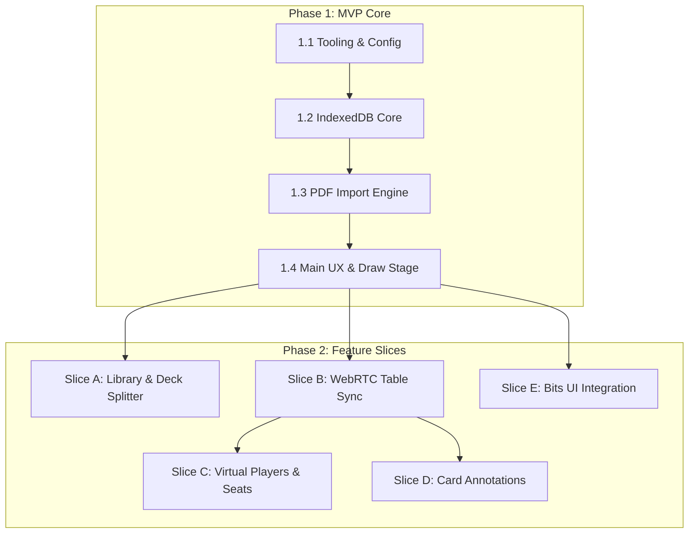

# Vibedeck — Comprehensive Implementation & Architecture Guide

This guide is a blueprint for building **Vibedeck (The Deck)**, a portable client-side card reader optimized for Monte Cook Games (MCG) decks. It breaks down the application into a Minimum Viable Product (MVP) core, followed by grouped feature slices. It provides architecture, database schemas, message protocols, and user experience (UX) guidelines without code implementations.

---

## Technical Stack & Documentation References

Prior to starting implementation, review the official documentation for the core libraries:

- **Framework**: [Svelte 5 Documentation](https://svelte.dev/docs/svelte/overview) (utilizing `$state`, `$derived`, `$effect`, and Svelte 5 component architecture).
- **Build System**: [Vite Guide](https://vite.dev/guide/) and [Vite Configuration](https://vite.dev/config/).
- **Language**: [TypeScript Handbook](https://www.typescriptlang.org/docs/handbook/intro.html).
- **Database**: [MDN IndexedDB API Reference](https://developer.mozilla.org/en-US/docs/Web/API/IndexedDB_API) and [Using IndexedDB](https://developer.mozilla.org/en-US/docs/Web/API/IndexedDB_API/Using_IndexedDB).
- **PDF Rendering**: [Mozilla PDF.js API](https://mozilla.github.io/pdf.js/api/draft/index.html).
- **WebRTC Networking**: [PeerJS API Documentation](https://peerjs.com/docs/).
- **QR Generation**: [npm qrcode Package Specification](https://www.npmjs.com/package/qrcode).
- **Headless UI Primitives**: [Bits UI Documentation](https://bits-ui.com/).
- **Quality & Validation**: [Oxlint Guidelines](https://github.com/oxc-project/oxc) and [Svelte-Check CLI](https://www.npmjs.com/package/svelte-check).

---



---

## Phase 1: The Minimum Viable Product (MVP)

The MVP delivers a single-user offline card reader. The user can import a card deck from a PDF, extract rules text, render high-resolution card faces, and draw/shuffle cards on mobile or desktop browsers.

### Step 1.1: Tooling, Build Configuration & File Tree

Configure the workspace using TypeScript, Svelte 5, and Vite. Maintain an asset-relative, standalone build capable of running offline from a local filesystem.

1. **Project Scaffold**: Initialize using Vite with the Svelte-TS template. Ensure dependencies in `package.json` include `svelte` (v5+), `typescript`, and `@sveltejs/vite-plugin-svelte`.
2. **Offline Portability Config (`vite.config.ts`)**:
   - Set `base: "./"`. This changes asset resolutions to relative paths, preventing absolute path failures when hosting in subfolders (e.g. GitHub Pages) or executing straight from `index.html`.
   - Configure `optimizeDeps.include` to explicitly list heavy libraries (like `peerjs`) to prevent dynamic runtime bundling delays.
3. **Type Safety & Resolution Rules (`tsconfig.json`)**:
   - Enable strict checks: `strict: true`.
   - Set `moduleResolution: "Bundler"` and `noEmit: true` so the Vite bundler handles module output.
   - Add a global declaration file (`src/global.d.ts`) to declare modules for `*.svelte` and `*.css`, and extend the `window` interface to support the global CDN-injected `pdfjsLib`.
4. **Style Foundation (`variables.css` & `base.css`)**:
   - Establish a dark, glowing sci-fantasy theme ("ancient technology") inside `src/css/variables.css`.
   - Predefine color variables: deep slate backgrounds (`#080810`, `#0f0f1a`), glowing amber accents (`#d4943a`, `#f0b855`), border colors (`#2a2a42`), status indicators, and subtle box-shadow glows.
   - Define typography in `base.css` utilizing `'Cinzel', serif` for high-fantasy titles and `'Crimson Pro', serif` for body copy and card descriptions.
5. **Formatting Rules**: Configure `oxlint` and `oxfmt` for static analysis and code formatting in the pre-commit workflow.

---

### Step 1.2: Database Core (IndexedDB)

Configure an offline-first storage mechanism. All application data remains client-side in the browser's IndexedDB.

1. **Database Schema (`the-deck-v1`)**:
   Create a database with the following object stores and indexes:
   - **`decks`**: Store deck metadata.
     - Primary Key: `id` (UUID generated string).
     - Properties: `name` (string), `cardCount` (number), `createdAt` (timestamp), `previewImage` (dataURL string representing the first card's thumbnail).
   - **`cards`**: Store card faces and data.
     - Primary Key: `id` (UUID string).
     - Indexes: Create an index on `deckId` to allow quick retrieval of all cards inside a deck.
     - Properties: `deckId` (string), `pageNum` (number), `front` (JPEG base64 dataURL), `back` (JPEG base64 dataURL or null), `text` (extracted string text).
   - **`drawState`**: Store draw queue status.
     - Primary Key: `deckId` (string).
     - Properties: `remaining` (array of card ID strings, representing the randomized pile), `drawn` (array of card ID strings, representing drawn cards in order).
   - **`history`**: Store chronological draw logs.
     - Primary Key: `id` (auto-incrementing number).
     - Indexes: Create an index on `deckId` for log filtering.
     - Properties: `deckId` (string), `cardId` (string), `drawnAt` (timestamp).

2. **Promise-Based Transaction Helper (`db.ts`)**:
   Implement standard utility wrappers around the browser's asynchronous callback-driven IndexedDB interface:
   - **Read/Write Operations**: Functions for get (`iGet`), put (`iPut`), and delete (`iDel`).
   - **Bulk Operations**: Implement a transaction-safe bulk writer (`iBulkPut`) that processes array imports within a single `"readwrite"` transaction.
   - **Index Queries**: Functions to retrieve all items (`iIdx`) and delete all items (`iDelIdx`) matching a specific index value.

---

### Step 1.3: PDF Import Engine & Text Extractor

Convert Monte Cook Games PDF rulebooks and card supplements into digital decks. Render pages to images and parse layout directions.

1. **PDF.js Configuration**:
   - Load the primary PDF.js script. Inject the worker source using a reliable CDN path (e.g. `cdnjs.cloudflare.com/ajax/libs/pdf.js/3.11.174/pdf.worker.min.js`) via `window.pdfjsLib.GlobalWorkerOptions.workerSrc`.
2. **Page Rendering Pipeline**:
   - Read the uploaded PDF file as an `ArrayBuffer` via `FileReader`.
   - Load the document using `pdfjsLib.getDocument`.
   - For each page:
     - Extract the page viewport at a chosen scale (e.g., standard: `1.5`, high: `2.0`, maximum: `3.0`).
     - Render the page onto a hidden HTML5 `<canvas>` element using `page.render()`.
     - Extract the image as a compressed JPEG data-URL using `canvas.toDataURL("image/jpeg", quality)`.
3. **Text Parsing**:
   - Extract layout text by executing `page.getTextContent()`.
   - Iterate through the text fragments, merging strings horizontally and cleaning up line breaks to construct a clean rule description.
4. **Layout Mapping Logic (1-Step vs 2-Step)**:
   Provide options for how PDF pages correspond to physical cards:
   - **Single-Sided Mode**: 1 page = 1 card. There is no back image.
   - **Paired Mode A**: Odd PDF pages are fronts, even PDF pages are backs.
   - **Paired Mode B (MCG Standard)**: Odd PDF pages are backs, even PDF pages are fronts. (MCG PDFs often print back designs first).
   - **Validation**: Ensure that paired modes verify the page count is even before starting the import process.

---

### Step 1.4: Main UX & The Draw Stage

Design a responsive mobile-first interface to display and interact with cards. State management is coordinated using Svelte 5 Runes.

1. **Global App State (`state.ts`)**:
   Convert the global store system to Svelte 5 reactive states. Expose reactive structures for:
   - `decks` (array of `Deck` interfaces)
   - `currentDeckId` (string or null)
   - `currentCard` (active `Card` object)
   - `drawState` (map of `deckId` to remaining/drawn arrays)
   - `history` (map of `deckId` to history entries)
   - View state: `activeTab` (string coordinating tabs: "draw", "history", "library", "table") and UI toggles (modal opens, lightbox states).
2. **Responsive CSS Grid/Flex Layout**:
   - The page layout contains three sections: a fixed top header (with logo and "+ Import" button), a central content panel displaying the active view, and a bottom tabbed navigation bar.
3. **Tactile 3D CSS Card Flip**:
   - Build a card wrapper container with a 3D perspective (`perspective: 1000px`).
   - Inside the container, place a card-inner element with `transform-style: preserve-3d` and a transition duration (e.g., `transform 0.6s cubic-bezier(0.4, 0, 0.2, 1)`).
   - Position two child cards (front face and back face) absolutely inside the inner element. Set both to `backface-visibility: hidden` so only the facing side is rendered.
   - Rotate the back face 180 degrees on the Y-axis (`transform: rotateY(180deg)`).
   - Control the rotation by toggling a CSS class (e.g. `.flipped`) on the inner element to rotate it 180 degrees (`transform: rotateY(180deg)`).
4. **Draw and Reshuffle Controls**:
   - **Draw Card**: Pop a random card ID from the `remaining` array, push it to the `drawn` array, update IndexedDB's `drawState`, append a new entry to the `history` store, and set `currentCard`.
   - **Progress Bar**: Display a progress bar detailing `drawn.length` / `totalCards`.
   - **Reshuffle**: Move all cards back to the `remaining` array, apply a Fisher-Yates shuffle algorithm, empty the `drawn` array, and write to database stores.
5. **Zoom Lightbox**: An overlay modal that expands the active card image to fill the screen on tap.

---

## Phase 2: Grouped Feature Slices

Once the core MVP is operational, implement the following feature slices to handle multi-deck organization, WebRTC sharing, seat registration, and annotations.

### Slice A: Library View & Deck Splitter

Manage imported decks, split composite PDFs into separate sub-decks, and clean up database space.

```
+-------------------------------------------------------------+
| LIBRARY: [ Cypher Deck ] [ GM Intrusion ] [ Split Deck... ] |
+-------------------------------------------------------------+
                               |
                               v (Opens Split Modal)
+-------------------------------------------------------------+
| [Thumbnail 1] [Thumbnail 2] | [Thumbnail 3] [Thumbnail 4]   |
| <----- Sub-Deck 1: 1-2 -----> | <----- Sub-Deck 2: 3-4 -----> |
|                                                             |
| Define Range: [ Sub-Deck Name ] [ Start Page ] to [ End ]   |
| [ Confirm Split & Create Decks ]                            |
+-------------------------------------------------------------+
```

1. **Library Interface**:
   - Render cards for each deck inside the database. Display the name, creation date, card count, and the preview thumbnail.
   - Provide options to:
     - Select the deck (activating it for drawing).
     - Delete the deck (cascading deletes to remove all cards, history items, and draw states).
     - Open the Split Modal.
2. **Split Modal UI & Range Selector**:
   - Load all cards in the selected deck, sorted by `pageNum`.
   - Render a grid of thumbnails (front faces).
   - Implement a range manager where users define named sub-decks with page ranges (e.g. "Sub-Deck A: pages 1 to 20", "Sub-Deck B: pages 21 to 40").
   - Highlight thumbnail borders in the grid with distinct colors representing each sub-deck range to visualize splits.
3. **Database Splitting Execution**:
   - On confirmation, create new entries in the `decks` store for each named split.
   - Copy the corresponding cards from the source deck, rewriting their `deckId` to point to the new deck.
   - Initialize a new randomized `drawState` for each split deck.
   - Delete the parent deck, its cards, and its draw states if the user selected the "clean up parent deck" option.

---

### Slice B: WebRTC Table Sync & Local Network Sharing

Allow a Game Master (GM) to host a session, and players to join and view shared cards in real time without a central server.

```
       +-----------------+
       |   Host (GM)     |
       +-----------------+
         /             \  (P2P Data Channels)
        v               v
+--------------+  +--------------+
|   Player 1   |  |   Player 2   |
+--------------+  +--------------+
```

1. **PeerJS Connection Lifecycle**:
   - **Host Setup**: The host registers with a PeerJS signaling server using a hashed 6-digit room code (`vibedeck-room-XXXXXX`). Listen for incoming connections (`peer.on("connection", ...)`). Maintain an active array of open data channels.
   - **Player Joining**: A player joins by entering the host's 6-digit room code or by reading the `?table=XXXXXX` URL search parameter. Establish a direct data connection to the host peer.
2. **QR Code Sharing Canvas**:
   - Use the `qrcode` library to draw the URL `https://<domain>/?table=XXXXXX` onto a `<canvas>` element inside the Table view for scanning.
3. **P2P Message Protocols**:
   Define JSON packet payloads containing a `type` string and data parameters:
   - `CARD_PUSH`: Broadcasts the active card details (ID, front image, back image, text description, flipped status, annotations) to connected clients.
   - `CARD_FLIP`: Informs clients to flip their active shared card display.
   - `CARD_CLEAR`: Instructs clients to remove the shared card from view.
   - `PLAYERS_SYNC`: Sent by the host to update the list of connected seats on all screens.
   - `TRADE_REQUEST`: Sent by a player requesting to pass a card to another seat.
   - `DISCARD_EVENT`: Sent by a player discarding a card.
   - `DISCARD_PILE_SYNC`: Broadcasts the current list of discarded cards.
4. **Client Table View & Hand Tray UX**:
   - Players see a clean display showing the host's broadcast card.
   - Keep a local hand array of cards pushed directly to the player.
   - Render these cards inside a horizontal scroll tray at the bottom of the screen.
   - **Dual Focus**: Clicking a card in the player's Hand Tray displays it in the center slot. Show a prominent banner indicating: _"Viewing private hand card [Return to Table]"_. Tapping the banner restores the main display to the GM's public broadcast card.

---

### Slice C: Seat Customization & Virtual Players

Handle player seats on the host. Allow GMs to add offline players or NPCs, inspect hands, and broker trades.

1. **Seat Management Registry**:
   - Extend the peer registry to track connected seats. Set `isVirtual: false` for active WebRTC connections, and `isVirtual: true` for offline seats created manually by the GM.
   - Define a global reactive dictionary `virtualPlayerHands` (`Record<string, Card[]>`) on the host to persist hand states.
2. **GM Hand Inspector**:
   - Display a listing of all active seats in the Table tab.
   - Provide a modal interface to inspect virtual seats.
   - Within the inspector modal, let the GM view, flip, or discard cards.
3. **Trading & Shared Discard Pile**:
   - **Trading**: When a player transmits a trade request (`TRADE_REQUEST`) containing a card payload and target seat, the host intercepts it:
     - If the target is virtual, the host adds the card to the target's hand array.
     - If the target is an active player, the host routes a direct connection send.
     - Return a confirmation to the sender to remove the card from their local hand tray.
   - **Discard Pile**: Maintain a shared `discardPile` array. If a player discards a card, they send a discard event to the host. The host adds the card to the discard list and broadcasts an updated list to all players.
   - **Recall Control**: Provide a control allowing GMs to recall a discarded card back to the deck or hand.

---

### Slice D: Card Annotations (Sticky Notes)

Give GMs and players the ability to append temporary text notes (like item charges, status effects, or names) to individual cards.

1. **Annotations Schema**:
   - Add an optional `annotations` string array to the `Card` interface definition.
2. **Edit Access Rules**:
   - **GM Controls**: The GM can edit annotations on any card (the active broadcasted card, cards inside virtual hands, or discarded cards).
   - **Player Controls**: Players can write annotations only on cards in their private Hand Tray.
3. **Synchronization**:
   - When a player modifies a card annotation, update the card state locally in their Hand Tray.
   - When the GM modifies an annotation on the shared card, the host fires an updated `CARD_PUSH` event containing the modified annotations array to update all player screens.

---

## Slice E: Accessibility & Headless Primitives (Bits UI Integration)

For advanced interface controls (such as nested select menus, accessible dialogs, and overlays), integrate Bits UI to handle interactive behavior while maintaining the custom Vanilla CSS design theme.

1. **Prerequisite Setup**:
   - Install `bits-ui` as a runtime dependency.
   - Reference: [Bits UI Documentation](https://bits-ui.com/docs/introduction)
2. **Accessible Modals (Dialog Primitive)**:
   - Replace custom modal overlay controls (e.g. Split Modal, Import Modal, virtual player inspectors) with the Bits UI `Dialog` primitive components.
   - Ensure focus-trapping, escape key closing, and viewport background clicks are managed automatically.
3. **Menu Navigation (Select and Dropdown Primitives)**:
   - Replace standard browser selects (such as layout configuration, auto-share targets, and scale settings) with the Bits UI `Select` or `DropdownMenu` primitives.
   - Bind options to Svelte 5 states/runes natively.
4. **Theme Overriding with Vanilla CSS**:
   - Style Bits UI components utilizing their exposed data attributes (e.g. `data-selected`, `data-highlighted`) or standard class configurations mapped to the CSS variables in `variables.css`.

---

## Slice F: Tablet View ("GM Screen") & Standalone PWA Support

Enable a tablet-optimized landscape dashboard supporting two layouts, wake-lock dimming prevention, and offline-capable standalone PWA installability.

1. **Dual-Layout Profiles**:
   - **GM Dashboard Layout**: A side-by-side console. Left panel handles deck selection, progress, and drawing controls. Right panel manages auto-share configurations, seat distribution, and virtual seat inspection.
   - **Table Display Layout**: A player-facing tabletop display. Centers the GM's broadcasted card, scaling it dynamically to fit the viewport. If no card is active, displays a runic pulsing seal placeholder. Includes a horizontal lower-sixth tray showing all player hands (peered and virtual).
2. **WebRTC Hand Sync Protocol**:
   - **Hand Update (`HAND_UPDATE`)**: Peered clients transmit their active hand list of card thumbnails to the host upon any hand mutation.
   - **Hands Sync (`HANDS_SYNC`)**: The host compiles peered client hands and virtual seat hands, broadcasting the aggregated state to all screens.
3. **Screen Wake Lock**:
   - Integrate the `navigator.wakeLock` API when in Table Display mode to prevent screens from dimming or falling asleep during long tabletop sessions.
4. **Standalone PWA Shell**:
   - Serve a caching service worker (`sw.js`) utilizing a stale-while-revalidate strategy, alongside an SVG app icon (`icon.svg`) and a Web App manifest (`manifest.json`) for standalone landscape execution.
